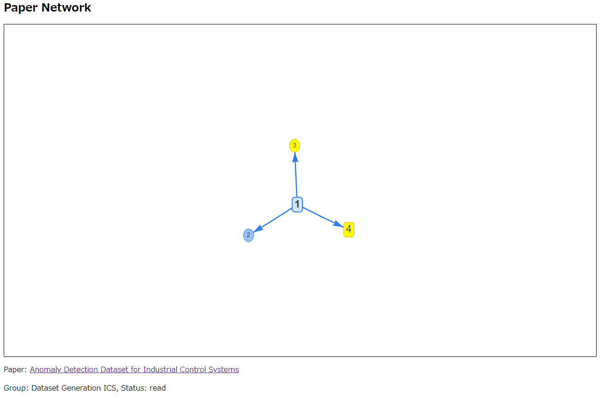

# paper-graph
論文リストのグラフ化

## 仕様
論文リスト (JSON形式) を読み込んで、[vis.js](https://visjs.org/) のフォーマットに従った JavaScript ファイルを生成する。

## 使い方
```
usage: generate_vis_js.py [-h] -l LIST -o OUT -t TEMPLATE

generate JavaScript Code

options:
  -h, --help            show this help message and exit
  -l LIST, --list LIST  JSON file (list of paper)
  -o OUT, --out OUT     Output JavaScript File
  -t TEMPLATE, --template TEMPLATE
                        Template JavaScript File
```

## 出力例
コードを実行後に `sample.html` を開いたもの

